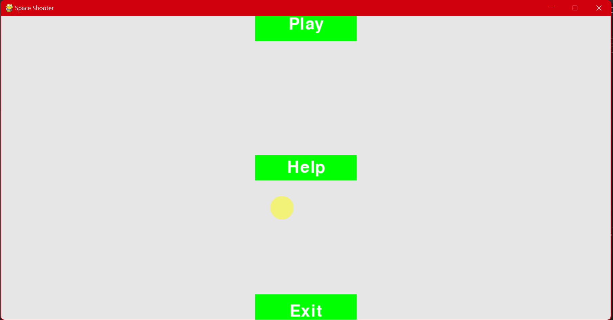
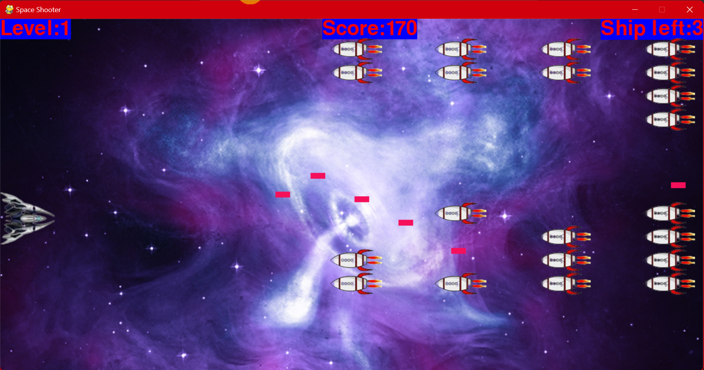

# Space Shooter

Space Shooter is an exciting Pygame-based game where the player controls a spaceship to defend against waves of invading aliens. The game is designed to be fun and challenging, with progressively harder levels as the player advances.

## Game Description

In Space Shooter, the player controls a ship. The player can move the ship up and down using the arrow keys and shoot bullets using the spacebar. When the game begins, a fleet of aliens fills the sky and moves towards the ship. The player shoots and destroys the aliens. If the player shoots all the aliens, a new fleet appears that moves faster than the previous fleet. If any alien hits the ship or reaches the screen's left border, the player loses a ship. If the player loses three ships, the game ends.

## Features

- **Smooth Controls**: Move the ship up and down with arrow keys.
- **Shooting Mechanism**: Shoot bullets with the spacebar to destroy aliens.
- **Progressive Difficulty**: New fleets of aliens move faster as you advance through levels.
- **Game Over Condition**: Lose a ship if hit by an alien or if an alien reaches the screen's left border. The game ends when all three ships are lost.
- **Sprite-based Graphics**: Uses Pygame sprites for efficient and smooth animations.





## Prerequisites

Make sure you have the following installed:

- Python 3.x
- Pygame library

You can install the required library using pip:

```bash
pip install pygame

